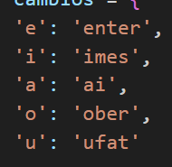
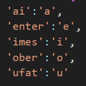

Hola amigos, bueno explicare brevemente mi proyecto, en la cual su funcion es Encriptar y Desencriptar un mensaje (reto propuesto por Alura).

El reto captura de una palabra algunas vocales (en caso de encriptacion) y las reemplaza por otro conjunto de letras.

Y tambien de la misma manera en la Desencriptacion, las reglas serian a la inversa:

Se le añadio un efecto de Holas al subtitulo que acompaña al logo de Alura

